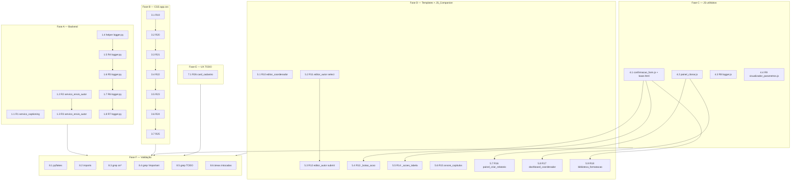

# Implementation Plan: Sanitização Backend + Frontend (SRA-PLI)

## Overview

Execução cirúrgica de 26 correções pontuais (R1–R26) e 6 não-funcionais (R27–R32) sobre `app/`, organizada em 6 fases (A–F) conforme o `design.md`. Máxima granularidade: 1 task por requisito sempre que viável. Nenhuma refatoração arquitetural, nenhum endpoint novo, nenhum schema tocado. Agentes recomendados:

- **Backend (Fase A)**: `sra-backend-fixer` ou `sra-code-sanitizer` para edições pontuais em `.py`.
- **Frontend (Fases B, C, D, E)**: `sra-frontend-fixer` para CSS, JS e templates.
- **Validação (Fase F)**: comandos shell `cmd` + `grep_search`.

Todas as tasks referenciam requisitos exatos e indicam o(s) arquivo(s) a ser(em) tocado(s) com o trecho-alvo. Não há tasks de PBT (vide `design.md` § Correctness Properties — propriedades 1–3 são verificadas por example-based / smoke, não justificam PBT).

## Tasks

### Fase A — Backend (R1–R7)

- [x] 1. Sanitização do backend Python
  - [x] 1.1 Remover variável local `tab` em `_anexar_numero_inline_equacao`
    - Arquivo: `app/services/servico_captioning.py`
    - Localizar a função `_anexar_numero_inline_equacao` e remover a atribuição da variável local `tab` que está atribuída e nunca usada
    - Remover qualquer comentário `# noqa: F841` órfão associado à atribuição removida
    - Preservar a estrutura XML produzida (mesmos filhos, atributos, texto e ordem) para os mesmos parâmetros de entrada
    - Validar com `python -m pyflakes app/services/servico_captioning.py` → não deve emitir `local variable 'tab' is assigned to but never used`
    - _Requisitos: R1.1, R1.2, R1.3, R1.4_

  - [x] 1.2 Remover variável local `cap_atual_norm` em `servico_envio_autor.py`
    - Arquivo: `app/services/servico_envio_autor.py` (linha ~101)
    - Remover atribuição e qualquer leitura da variável `cap_atual_norm` na função onde está declarada
    - Preservar valor de retorno e efeitos colaterais da função inalterados para os mesmos parâmetros
    - Validar com `python -m pyflakes app/services/servico_envio_autor.py` → não deve emitir `local variable 'cap_atual_norm' is assigned to but never used`
    - Validar com `python -c "import app.services.servico_envio_autor"` → exit code 0
    - _Requisitos: R2.1, R2.2, R2.3, R2.4_

  - [x] 1.3 Remover import não usado `ServicoExtracaoCanonica` em `servico_envio_autor.py`
    - Arquivo: `app/services/servico_envio_autor.py` (linha ~225)
    - Remover **apenas** o import de `ServicoExtracaoCanonica` próximo à linha 225, preservando outros imports do mesmo símbolo em escopos onde ele é efetivamente utilizado
    - Validar com `python -m pyflakes app/services/servico_envio_autor.py` → exit code 0 sem `imported but unused` para `ServicoExtracaoCanonica`
    - Validar com `python -c "import app.services.servico_envio_autor"` → exit code 0 sem `ImportError`/`NameError`
    - Preservar Comportamento_Observavel das funções inalterado
    - _Requisitos: R3.1, R3.2, R3.3, R3.4_

  - [x] 1.4 Adicionar helper `_logar_warning_sem_recursao` em `logger.py`
    - Arquivo: `app/utils/logger.py`
    - Adicionar no escopo do módulo (antes da classe `SRALogHandler`):
      - Logger nomeado `_logger_handler_emit = logging.getLogger('sra.handler_emit')` com `propagate = False` e `StreamHandler` próprio (formatter `'%(asctime)s - %(name)s - %(levelname)s - %(message)s'`, nível `WARNING`)
      - Função privada `_logar_warning_sem_recursao(contexto: str, exc: BaseException) -> None` que registra warning via `_logger_handler_emit.warning("Falha em %s: %s: %s", contexto, type(exc).__name__, str(exc))` envolto em `try/except Exception: pass` interno
    - Esse helper habilita R4–R7 sem reentrar no próprio `SRALogHandler`
    - _Requisitos: pré-requisito de R4.5, R5.5, R6.5, R7.2, R7.5 (vide design § "Estratégia de não-recursão")_

  - [x] 1.5 Substituir `except Exception: pass` no bloco `current_user.nome` em `SRALogHandler.emit`
    - Arquivo: `app/utils/logger.py` (método `SRALogHandler.emit`)
    - Substituir `except Exception: pass` do bloco `try` que obtém `current_user.nome` por:
      - `except Exception as exc:` que chama `_logar_warning_sem_recursao('obtenção de current_user.nome em SRALogHandler.emit', exc)` e atribui `user_name = 'anonymous'` antes de prosseguir
    - Validar grep: `grep_search` por `except Exception: pass` em `app/utils/logger.py` no bloco — 0 resultados nessa região
    - _Requisitos: R4.1, R4.2, R4.3, R4.4, R4.5_

  - [x] 1.6 Substituir `except Exception: pass` no bloco `session.perfil_ativo` em `SRALogHandler.emit`
    - Arquivo: `app/utils/logger.py` (método `SRALogHandler.emit`)
    - Substituir `except Exception: pass` do bloco `try` que obtém `session.get('perfil_ativo')` por:
      - `except Exception as exc:` que chama `_logar_warning_sem_recursao('obtenção de session.perfil_ativo em SRALogHandler.emit', exc)` e atribui string vazia ao campo `perfil` antes de prosseguir
    - _Requisitos: R5.1, R5.2, R5.3, R5.4, R5.5_

  - [x] 1.7 Substituir `except Exception: pass` no bloco `request.path/method` em `SRALogHandler.emit`
    - Arquivo: `app/utils/logger.py` (método `SRALogHandler.emit`)
    - Substituir `except Exception: pass` do bloco `try` que obtém `request.path` e `request.method` por:
      - `except Exception as exc:` que chama `_logar_warning_sem_recursao('obtenção de request.path/request.method em SRALogHandler.emit', exc)` e atribui strings vazias aos campos `path` e `method` antes de prosseguir
    - _Requisitos: R6.1, R6.2, R6.3, R6.4, R6.5_

  - [x] 1.8 Substituir `except Exception` externo em `SRALogHandler.emit`
    - Arquivo: `app/utils/logger.py` (método `SRALogHandler.emit`)
    - No `except Exception` externo (que envolve todo o `emit`):
      - Trocar `pass` (se for o caso) por `exc as exc` + chamada a `_logar_warning_sem_recursao('SRALogHandler.emit (externo)', exc)`
      - **Preservar** a chamada existente a `self.handleError(record)` no caminho de exceção
    - Garantir que nenhuma das 4 ocorrências literais `except Exception: pass` sobrevive em `SRALogHandler.emit` após R5/R6/R7/R8
    - _Requisitos: R7.1, R7.2, R7.3, R7.4, R7.5_

- [x] 2. Checkpoint backend
  - Rodar `python -m pyflakes app/services/servico_captioning.py app/services/servico_envio_autor.py app/utils/logger.py` e confirmar saída limpa para R1, R2, R3
  - Rodar `python -c "import app.services.servico_envio_autor"`, `python -c "import app.services.servico_captioning"`, `python -c "import app.utils.logger"` — todos exit 0
  - Ensure all tests pass, ask the user if questions arise.

### Fase B — CSS (R19–R25)

- [x] 3. Remoção de `!important` em `app/static/css/app.css`
  - [x] 3.1 Remover `!important` em `.sigma-pli-conteiner__icon--lg svg` (`stroke`/`fill`/`stroke-width`)
    - Arquivo: `app/static/css/app.css`
    - Pré-edição: `grep_search` por `.sigma-pli-conteiner__icon--lg` em `app/static/css/` para identificar regras concorrentes
    - Remover `!important` das declarações `stroke`, `fill` e `stroke-width` da regra que mira `.sigma-pli-conteiner__icon--lg svg` e `.sigma-pli-conteiner__icon--lg svg *`
    - Se houver concorrência detectada, dobrar a classe pai (`.sigma-pli-conteiner__icon--lg.sigma-pli-conteiner__icon--lg svg`) para subir especificidade sem reintroduzir `!important`
    - Preservar restante de `app.css` fora do bloco modificado
    - _Requisitos: R19.1, R19.2, R19.3, R19.4_

  - [x] 3.2 Remover `!important` em `.sra-tree__item--hidden { display: none }`
    - Arquivo: `app/static/css/app.css`
    - Pré-edição: `grep_search` por `.sra-tree__item--hidden` em `app/static/css/`
    - Remover `!important` da declaração `display: none` da regra
    - Em conflito: dobrar a classe (`.sra-tree__item--hidden.sra-tree__item--hidden`) para preservar ocultação
    - Preservar demais `!important` do arquivo fora desta regra
    - _Requisitos: R20.1, R20.2, R20.3, R20.4_

  - [x] 3.3 Remover `!important` em `.sra-tree__toggle[hidden] { display: none }`
    - Arquivo: `app/static/css/app.css`
    - Pré-edição: `grep_search` por `.sra-tree__toggle\[hidden\]` em `app/static/css/`
    - Remover `!important` da declaração `display: none`
    - Em conflito: dobrar atributo (`.sra-tree__toggle[hidden][hidden]`)
    - _Requisitos: R21.1, R21.2, R21.3, R21.4_

  - [x] 3.4 Remover `!important` em `.sra-table--cap-collapsible .sra-cap-row--hidden { display: none }`
    - Arquivo: `app/static/css/app.css`
    - Pré-edição: `grep_search` por `.sra-cap-row--hidden` em `app/static/css/`
    - Remover `!important` da declaração `display: none`
    - Em conflito: dobrar a classe (`.sra-cap-row--hidden.sra-cap-row--hidden`)
    - Após edição, garantir que a classe alterna corretamente em runtime (toggle dinâmico funcional sem reload)
    - _Requisitos: R22.1, R22.2, R22.3, R22.4, R22.5_

  - [x] 3.5 Remover `!important` em `.sra-table__header--left { text-align: left }`
    - Arquivo: `app/static/css/app.css`
    - Pré-edição: `grep_search` por `.sra-table__header--left` em `app/static/css/`
    - Remover `!important` da declaração `text-align: left`
    - Preservar demais declarações da regra original
    - _Requisitos: R23.1, R23.2, R23.3, R23.4_

  - [x] 3.6 Remover `!important` em `.sra-cap-toggle[hidden] { display: none }`
    - Arquivo: `app/static/css/app.css`
    - Pré-edição: `grep_search` por `.sra-cap-toggle\[hidden\]` em `app/static/css/`
    - Remover `!important` da declaração `display: none`
    - _Requisitos: R24.1, R24.2, R24.3_

  - [x] 3.7 Remover `!important` em `.sra-cap-cell--title { text-align: left }`
    - Arquivo: `app/static/css/app.css`
    - Pré-edição: `grep_search` por `.sra-cap-cell--title` em `app/static/css/`
    - Remover `!important` da declaração `text-align: left`
    - Preservar demais declarações da regra original
    - _Requisitos: R25.1, R25.2, R25.3, R25.4_

### Fase C — JS utilitários e modernização (R8, R9, criação de utilities)

- [x] 4. Criar utilitários JS e modernizar JS existentes
  - [x] 4.1 Criar `confirmacao_form.js` e injetar em `layouts/base.html`
    - Arquivo novo: `app/static/js/confirmacao_form.js`
    - Conteúdo (vide design § "Carregamento do JS_Utilitario_Confirmacao", esboço completo):
      - IIFE com `'use strict'`
      - Função `instalar()` que percorre `document.querySelectorAll('form[data-confirm]')` e registra `addEventListener('submit', ...)` em cada form
      - Sentinela `data-confirm-instalado="1"` para idempotência (R28, R13.6, propriedade 3 do design)
      - Em `submit`: ler `data-confirm-message`; fallback `'Confirmar ação?'` se ausente/vazio (R13.4)
      - Em cancelamento: `event.preventDefault()` + `event.stopPropagation()` (R13.5)
      - Inicialização: se `document.readyState === 'loading'` aguardar `DOMContentLoaded`; senão chamar `instalar()` direto
    - Arquivo: `app/templates/layouts/base.html` — inserir `<script src="{{ static_v('js/confirmacao_form.js') }}" defer></script>` no bloco de scripts globais (próximo ao final do `<body>`, antes de qualquer `` filho)
    - O utilitário NÃO modifica payload nem CSRF_Token — apenas decide se o submit prossegue
    - _Requisitos: pré-requisito de R13, R14, R18; cumpre R28, R29, R30_

  - [x] 4.2 Criar `painel_clonar.js`
    - Arquivo novo: `app/static/js/painel_clonar.js`
    - Conteúdo (vide design § "Componente `painel_clonar.js`"):
      - IIFE com `'use strict'`
      - Função `instalar()` que percorre `document.querySelectorAll('[data-clonar-da-biblioteca]')` e registra `addEventListener('click', ...)` em cada botão
      - Sentinela `data-clonar-instalado="1"` para idempotência (propriedade 3 do design)
      - Em `click`: verificar `typeof window.clonarDaBiblioteca === 'function'`; ler argumentos via `data-arg-*` (`data-arg-id`, `data-arg-tipo`, etc.); invocar `window.clonarDaBiblioteca(arg1, arg2, ...)`
      - Inicialização condicional via `DOMContentLoaded`
    - **NÃO** mover/redefinir a função global `clonarDaBiblioteca` — preservar a definição original onde quer que esteja
    - O conjunto exato de argumentos será confirmado durante R16 e R17 (leitura literal de `painel_criar_relatorio_producao.html:66` e `dashboard_coordenador.html:101`)
    - _Requisitos: pré-requisito de R16, R17; cumpre R29, R30_

  - [x] 4.3 Modernizar `var` → `let`/`const` em `logger.js`
    - Arquivo: `app/static/js/logger.js`
    - Aplicar regras do agente `sra-code-sanitizer`:
      - Para cada `var X = ...`: se `X` é referenciado APENAS no menor bloco `{ }` que o contém, NÃO é usado antes da linha de declaração e NÃO é redeclarado no mesmo escopo:
        - `const X` se nunca for reatribuído (`=`, `+=`, `-=`, `*=`, `/=`, `%=`, `++`, `--`)
        - `let X` se houver pelo menos uma reatribuição posterior
      - Caso contrário: preservar `var` original
    - NÃO introduzir novos `console.error`/`console.warn` durante carga/interação
    - Limitar alterações exclusivamente a este arquivo
    - _Requisitos: R8.1, R8.2, R8.3, R8.4_

  - [x] 4.4 Modernizar `var` → `let`/`const` em `visualizador_parametros.js`
    - Arquivo: `app/static/js/visualizador_parametros.js`
    - Mesmas regras da task 4.3 (whitelist do `sra-code-sanitizer`)
    - Se uma substituição introduzida resultar em alteração observável (TDZ, hoisting quebrado), reverter aquela substituição específica preservando `var` original (R9.4)
    - _Requisitos: R9.1, R9.2, R9.3, R9.4, R9.5_

### Fase D — Templates e JS_Companion (R10–R18)

- [x] 5. Migrar handlers inline para `addEventListener`
  - [x] 5.1 Migrar `onchange` de `editor_coordenador.html` para `editor_coordenador.js`
    - Arquivo: `app/templates/editor_coordenador.html` — remover atributo `onchange=` (e qualquer outro `on*`) do elemento `<select id="ec-rel-select">`
    - Arquivo: `app/static/js/editor_coordenador.js` — adicionar dentro do bloco `DOMContentLoaded`:
      - `const sel = document.getElementById('ec-rel-select');`
      - `if (sel) sel.addEventListener('change', (ev) => { const v = ev.target.value; if (v) window.location.href = v; });`
    - Garantir registro de exatamente 1 listener em `change`
    - Em `value` vazio/`null`/`undefined` → não alterar `window.location.href`
    - Em ausência do elemento `#ec-rel-select` → não lançar exceção e não registrar listener
    - _Requisitos: R10.1, R10.2, R10.3, R10.4, R10.5_

  - [x] 5.2 Migrar `onchange` de `editor_autor.html` (`#ea-rel-select`) para `editor_autor.js`
    - Arquivo: `app/templates/editor_autor.html` — remover atributo `onchange=` (e qualquer `on*`) do elemento `<select id="ea-rel-select">`
    - Arquivo: `app/static/js/editor_autor.js` — adicionar dentro do bloco `DOMContentLoaded`:
      - `const sel = document.getElementById('ea-rel-select');`
      - `if (sel) sel.addEventListener('change', (ev) => { const v = ev.target.value; if (v) window.location.href = v; });`
    - Mesmas garantias de R10 (exatamente 1 listener; valor vazio não navega; ausência do elemento não lança)
    - _Requisitos: R11.1, R11.2, R11.3, R11.4, R11.5_

  - [x] 5.3 Migrar `onsubmit` do form de envio final em `editor_autor.html` para `editor_autor.js`
    - Arquivo: `app/templates/editor_autor.html` (linha ~317) — remover atributo `onsubmit=` do formulário de envio final (form `class="acao-form"` cujo `action` aponta ao endpoint de envio final)
    - Adicionar marcador estável no form (ex.: `data-envio-final="1"`) para localização robusta no JS
    - Arquivo: `app/static/js/editor_autor.js` — adicionar dentro do `DOMContentLoaded`:
      - `const form = document.querySelector('form.acao-form[data-envio-final="1"]');`
      - `if (form) form.addEventListener('submit', (ev) => { if (!window.confirm('Enviar conteúdo final ao coordenador? Depois disso sua edição ficará bloqueada.')) { ev.preventDefault(); ev.stopPropagation(); } });`
    - Texto do `confirm` deve ser **exatamente** `Enviar conteúdo final ao coordenador? Depois disso sua edição ficará bloqueada.` (R12.3)
    - Em cancelamento: impedir envio e preservar página atual sem navegação (R12.4)
    - Em confirmação: submeter ao endpoint de `action` preservando `csrf_token` inalterado (R12.5, R28)
    - _Requisitos: R12.1, R12.2, R12.3, R12.4, R12.5_

  - [x] 5.4 Migrar `onsubmit` do macro `_botao_acao` para `data-confirm`
    - Arquivo: `app/templates/components/_botao_acao.html`
    - Remover atributo `onsubmit=` do `<form>` do macro
    - Adicionar atributos `data-confirm` (presença booleana) e `data-confirm-message="<mensagem original>"` ao `<form>` — copiar **verbatim** a string que o `onsubmit` original passava ao `confirm()` (preservar aspas, pontuação, interpolação Jinja)
    - O utilitário `confirmacao_form.js` (criado em 4.1) cuida do binding global
    - Preservar CSRF_Token e demais campos do form inalterados
    - _Requisitos: R13.1, R13.2, R13.3, R13.4, R13.5, R13.6, R13.7, R13.8_

  - [x] 5.5 Migrar `onsubmit` do macro `btn_excluir` em `_acoes_tabela.html` para `data-confirm`
    - Arquivo: `app/templates/components/_acoes_tabela.html`
    - No macro `btn_excluir`: remover atributo `onsubmit=` do `<form>`
    - Adicionar `data-confirm` e `data-confirm-message="{{ confirmacao }}"` (parâmetro `confirmacao` do macro, default `Excluir este item e seu arquivo associado?`)
    - Preservar CSRF_Token e Comportamento_Observavel das telas que renderizam `btn_excluir`
    - _Requisitos: R14.1, R14.2, R14.3, R14.4_

  - [x] 5.6 Migrar `onchange` de `arvore_capitulos.html` para `app.js`
    - Arquivo: `app/templates/components/relatorio/arvore_capitulos.html` — remover atributo `onchange=` (e qualquer `on*`) do elemento `<select id="seletor_relatorio">`
    - Arquivo: `app/static/js/app.js` — adicionar dentro do `DOMContentLoaded`:
      - `const sel = document.getElementById('seletor_relatorio');`
      - `if (sel) sel.addEventListener('change', (ev) => { const v = ev.target.value; if (v) window.location.href = '/relatorio/versao-trabalho/' + v; });`
    - Garantir exatamente 1 listener; valor vazio/`null`/`undefined` → não navega; ausência do elemento → não lança
    - _Requisitos: R15.1, R15.2, R15.3, R15.4, R15.5_

  - [x] 5.7 Migrar `onclick="clonarDaBiblioteca(...)"` de `painel_criar_relatorio_producao.html` para `painel_clonar.js`
    - Arquivo: `app/templates/components/paineis/painel_criar_relatorio_producao.html` (linha ~66)
    - **Antes** de editar: ler a linha 66 literalmente para extrair os argumentos passados a `clonarDaBiblioteca(...)`
    - Remover atributo `onclick=` do botão alvo
    - Adicionar atributos: `data-clonar-da-biblioteca` (presença) + `data-arg-*` mapeando cada argumento do `onclick` original (ex.: `data-arg-id="{{ ... }}"`, `data-arg-tipo="{{ ... }}"`)
    - Adicionar no template: `<script src="{{ static_v('js/painel_clonar.js') }}" defer></script>` no `` da tela
    - Preservar a definição global da função `clonarDaBiblioteca` em sua localização atual (R16.2)
    - Preservar Comportamento_Observavel: CSRF_Token, método/URL alvo, atualizações de UI
    - _Requisitos: R16.1, R16.2, R16.3, R16.4, R16.5, R16.6_

  - [x] 5.8 Migrar `onclick="clonarDaBiblioteca(...)"` de `dashboard_coordenador.html` para `painel_clonar.js`
    - Arquivo: `app/templates/components/paineis/dashboard_coordenador.html` (linha ~101)
    - **Antes** de editar: ler a linha 101 literalmente para extrair os argumentos
    - Remover atributo `onclick=` do botão alvo
    - Adicionar `data-clonar-da-biblioteca` + `data-arg-*` correspondentes
    - Adicionar `<script src="{{ static_v('js/painel_clonar.js') }}" defer></script>` no `` da tela (reusa o JS_Dedicado da task 5.7)
    - Se a assinatura de `clonarDaBiblioteca` divergir entre 5.7 e 5.8, parametrizar via `data-*` distintos (vide design § "Riscos conhecidos")
    - _Requisitos: R17.1, R17.2, R17.3, R17.4, R17.5, R17.6_

  - [x] 5.9 Migrar `onsubmit` de `biblioteca_formatacao.html` para `data-confirm`
    - Arquivo: `app/templates/components/configuracoes/biblioteca_formatacao.html` (linha ~19)
    - Remover atributo `onsubmit=` (e qualquer atributo iniciado por `on`) do `<form>` alvo
    - Adicionar `data-confirm` e `data-confirm-message='Excluir biblioteca "{{ b.nome_biblioteca }}"? Esta ação não pode ser desfeita.'` (preservar exatamente aspas, pontuação, capitalização e interpolação Jinja)
    - O utilitário `confirmacao_form.js` (criado em 4.1) cuida do binding
    - Preservar `action`, `method` e CSRF_Token do form
    - _Requisitos: R18.1, R18.2, R18.3, R18.4_

- [x] 6. Checkpoint frontend
  - Confirmar via `grep_search` que não restam atributos inline `onclick=`, `onchange=`, `onsubmit=` nos templates listados em R10–R18
  - Confirmar que `confirmacao_form.js` está incluído em `layouts/base.html` e `painel_clonar.js` está incluído em `painel_criar_relatorio_producao.html` e `dashboard_coordenador.html`
  - Ensure all tests pass, ask the user if questions arise.

### Fase E — UX TODO (R26)

- [x] 7. Resolver `TODO` em `card_cadastro_relatorio_versao_trabalho.html`
  - [x] 7.1 Resolver decisão de UX e remover marcador `TODO`
    - Arquivo: `app/templates/components/relatorio/card_cadastro_relatorio_versao_trabalho.html` (linha 38)
    - **PARAR** e perguntar ao usuário antes de editar: "A funcionalidade descrita pelo TODO já existe em outro fluxo do sistema?"
    - Se SIM: remover do template o bloco do card associado ao `TODO` (card não renderiza mais)
    - Se NÃO: manter o card no template e substituir o texto original por rótulo visível em PT-BR contendo a expressão "em desenvolvimento"; remover o comentário `TODO`
    - Em qualquer caminho: garantir que `grep_search` por `TODO` em `card_cadastro_relatorio_versao_trabalho.html` retorna 0 ocorrências
    - Preservar Comportamento_Observavel das demais áreas do template (cards, botões, links, formulários, mensagens)
    - Em caso de erro de sintaxe Jinja2 ou falha de renderização, reverter ao estado anterior
    - _Requisitos: R26.1, R26.2, R26.3, R26.4, R26.5, R26.6_

### Fase F — Validação final (R32 + cobertura cruzada de NF6)

- [x] 8. Validações estáticas e greps de fechamento
  - [x] 8.1 Validar pyflakes para R1, R2, R3
    - Comando: `cmd /c "python -m pyflakes app"`
    - Esperado: ausência das mensagens `local variable 'tab' is assigned to but never used` em `app/services/servico_captioning.py`, `local variable 'cap_atual_norm' is assigned to but never used` em `app/services/servico_envio_autor.py` e `imported but unused` para `ServicoExtracaoCanonica` em `app/services/servico_envio_autor.py`
    - Demais warnings pré-existentes podem permanecer (escopo limitado a R1–R3)
    - _Requisitos: R32.1_

  - [x] 8.2 Validar imports dos módulos backend afetados
    - Comandos `cmd`:
      - `cmd /c "python -c \"import app.services.servico_captioning\""`
      - `cmd /c "python -c \"import app.services.servico_envio_autor\""`
      - `cmd /c "python -c \"import app.utils.logger\""`
    - Cada um deve retornar exit code 0 sem `ImportError`/`ModuleNotFoundError`/`NameError`/`SyntaxError`
    - _Requisitos: R1.x, R2.3, R3.3_

  - [x] 8.3 Validar ausência de handlers inline `on*` nos templates de R10–R18
    - Usar `grep_search` (tool) com `query` `\\bon(click|change|submit)=` e `includePattern` para cada template:
      - `app/templates/editor_coordenador.html` (R10)
      - `app/templates/editor_autor.html` (R11, R12)
      - `app/templates/components/_botao_acao.html` (R13)
      - `app/templates/components/_acoes_tabela.html` (R14)
      - `app/templates/components/relatorio/arvore_capitulos.html` (R15)
      - `app/templates/components/paineis/painel_criar_relatorio_producao.html` (R16)
      - `app/templates/components/paineis/dashboard_coordenador.html` (R17)
      - `app/templates/components/configuracoes/biblioteca_formatacao.html` (R18)
    - Esperado: 0 resultados em cada arquivo
    - _Requisitos: R32.2_

  - [x] 8.4 Validar ausência de `!important` nas regras CSS de R19–R25
    - Usar `grep_search` (tool) sobre `app/static/css/app.css` para cada seletor:
      - `.sigma-pli-conteiner__icon--lg svg` (R19)
      - `.sra-tree__item--hidden` (R20)
      - `.sra-tree__toggle\[hidden\]` (R21)
      - `.sra-table--cap-collapsible .sra-cap-row--hidden` (R22)
      - `.sra-table__header--left` (R23)
      - `.sra-cap-toggle\[hidden\]` (R24)
      - `.sra-cap-cell--title` (R25)
    - Para cada bloco da regra: confirmar que a string `!important` não aparece nas declarações alteradas
    - Demais `!important` do arquivo (fora dessas regras) devem permanecer
    - _Requisitos: R32.3_

  - [x] 8.5 Validar ausência de `TODO` em `card_cadastro_relatorio_versao_trabalho.html`
    - Usar `grep_search` (tool) com `query` `TODO` e `includePattern` `app/templates/components/relatorio/card_cadastro_relatorio_versao_trabalho.html`
    - Esperado: 0 resultados
    - _Requisitos: R26.1_

  - [x] 8.6 Validar áreas intocadas (R31)
    - Confirmar via `git status` ou `grep_search` que não houve alteração em:
      - Qualquer arquivo sob `app/static/editor-react/`
      - `.env`, qualquer arquivo sob `migrations/`, qualquer arquivo sob `storage/`, `requirements.txt`, `package-lock.json`
      - Os blocos de tratamento de exceção listados como "manter intocados": `app/services/servico_relatorio.py:101`, `app/services/servico_sanitizar_docx.py:534`, as duas ocorrências em `app/services/servico_capa.py`, `app/routes/relatorio.py:774`, `app/services/servico_finalizar_relatorio.py:109`
    - _Requisitos: R31.1, R31.2, R31.3_

- [x] 9. Checkpoint final
  - Revisar resumo de todas as edições aplicadas e confirmar cobertura de R1–R26 + NF R27–R32
  - Ensure all tests pass, ask the user if questions arise.

## Notes

- **Nenhuma task de PBT**: o `design.md` declara explicitamente que as 3 propriedades de correção são verificadas por example-based / smoke (não justificam PBT — espaço de entrada pequeno, custo/benefício desfavorável).
- **Idioma**: comentários, mensagens de log, identificadores e textos exibidos seguem PT-BR (R29).
- **Cache-busting**: todas as referências a novos assets em templates Jinja usam `{{ static_v('caminho') }}` (R30).
- **CSRF_Token**: nenhuma task remove ou altera proteção CSRF (R28).
- **Áreas intocadas**: nenhuma task edita `app/static/editor-react/`, `.env`, `migrations/`, `storage/`, `requirements.txt`, `package-lock.json` (R31).
- **Granularidade**: 1 task por requisito sempre que viável; R4–R7 separados em 1.5–1.8 + helper compartilhado em 1.4 (todos no mesmo arquivo `logger.py`, serializados em waves diferentes).
- **Agente recomendado para execução**: `spec-task-execution` aciona `sra-backend-fixer` (Fase A), `sra-frontend-fixer` (Fases B, C, D, E) e shell direto (Fase F).

## Task Dependency Graph



```json
{
  "waves": [
    { "id": 0, "tasks": ["1.1", "1.2", "1.4", "3.1", "4.1", "4.2", "4.3", "4.4", "5.1", "5.2", "5.6", "7.1"] },
    { "id": 1, "tasks": ["1.3", "1.5", "3.2", "5.3", "5.4", "5.7"] },
    { "id": 2, "tasks": ["1.6", "3.3", "5.5", "5.8", "5.9"] },
    { "id": 3, "tasks": ["1.7", "3.4"] },
    { "id": 4, "tasks": ["1.8", "3.5"] },
    { "id": 5, "tasks": ["3.6"] },
    { "id": 6, "tasks": ["3.7"] },
    { "id": 7, "tasks": ["8.1", "8.2", "8.3", "8.4", "8.5", "8.6"] }
  ]
}
```
