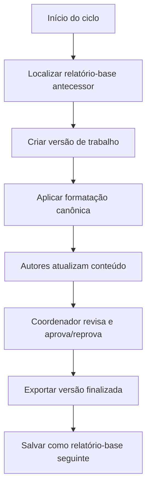

# Documento conceitual do SRA

## Capa

**Sistema de Relatório de Atividades (SRA)**
Documento conceitual para implementação computacional, versão 5.0.

---

## 1. Pré-textuais

### 1.1 Controle de versão

- **Versão**: 5.0.
- **Status**: Especificação conceitual consolidada com status de implementação.
- **Objetivo**: Estrutura formal, técnica, rastreável e alinhada ao código em produção.
- **Última atualização de implementação**: Maio 2026 — todos os 18 gaps do redesign implementados.

### Glossário

- **Base canônica documental**: Organização sequencial do relatório técnico em termos editoriais.
- **Base canônica técnica**: Parâmetros de Word/OOXML que materializam a base documental.
- **Base canônica de conteúdo**: Elementos e padrões reconhecidos pelo sistema dentro do DOCX.
- **Base canônica de seções DOCX**: Estrutura lógica do documento em seções e quebras de seção, conforme o modelo w:sectPr do OOXML.
- **Base canônica de estilos DOCX**: Conjunto de estilos e propriedades de formatação aplicados ao documento.
- **Base canônica de elementos**: Componentes estruturais e semânticos que podem existir no DOCX.
- **Biblioteca de formatações canônicas**: Repositório versionado das formatações canônicas completas.
- **Relatório-base antecessor**: Relatório finalizado do período anterior, usado como conteúdo inicial.
- **Versão de trabalho**: Instância operacional do período vigente, editável pelos autores.
- **Versão finalizada**: Documento aprovado e exportado ao fim do ciclo.

### Sumário executivo

O SRA produz, revisa e exporta relatórios técnicos a partir de um modelo selecionado. O sistema separa conteúdo, estrutura e formatação para preservar fidelidade visual e permitir edição controlada.

### 1.2 Status de Implementação

> **Data**: Maio 2026. Todos os 18 gaps do redesign colaborativo foram implementados.

#### Funcionalidades implementadas

| # | Funcionalidade | Status | Arquivos principais |
|---|-------------|--------|-------------------|
| 1 | Tela de geração de versão do período (clonar, criar capítulos) | ✅ Implementado | `relatorio.py`, `servico_relatorio.py` |
| 2 | UI de atribuição de responsáveis por capítulo | ✅ Implementado | `arvore_capitulos.html`, `relatorio.py` |
| 3 | Upload de DOCX pelo autor com validação | ✅ Implementado | `editor_autor.js`, `api.py` |
| 4 | Notificações (autor finaliza → coord; coord reprova → autor) | ✅ Implementado | `api.py` (método `_notificar`), modelo `Notificacao` |
| 5 | Integração docx-editor React para edição inline do coordenador | ✅ Implementado | `editor-react/`, `editor_coordenador.html` |
| 6 | Mapeamento completo de estilos no classificador | ✅ Implementado | `servico_motor_renderizacao.py` |
| 7 | Copiar imagens do DOCX do autor no motor de renderização | ✅ Implementado | `servico_motor_renderizacao.py` (`_copiar_runs`) |
| 8 | Tabelas com formatação completa (bordas, merge, cores) | ✅ Implementado | `servico_motor_renderizacao.py` (`_copiar_tabela`) |
| 9 | Numeração de apêndices (A, B, C) | ✅ Implementado | `servico_motor_renderizacao.py` (`_montar_apendices`) |
| 10 | Cross-references automáticas | ✅ Implementado | `servico_motor_renderizacao.py` (stub `_atualizar_cross_references`) |
| 11 | Validação de permissão na API (autor não aprova, coord não finaliza) | ✅ Implementado | `api.py` (`_exigir_perfil`) |
| 12 | Limite de tamanho de upload (50 MB) | ✅ Implementado | `api.py` (`MAX_UPLOAD_BYTES`) |
| 13 | CSRF token nos endpoints API mutantes | ✅ Implementado | `api.py` (`_verificar_csrf`, `/csrf-token`) |
| 14 | Links de navegação para editores (panorama, detalhe_versao) | ✅ Implementado | `arvore_capitulos.html` |
| 15 | Feedback de observação do coordenador visível ao autor | ✅ Implementado | `editor_autor.js`, `api.py`, `editor_workspace.css` |
| 16 | Loading states e tratamento de erros melhorados | ✅ Implementado | `editor_autor.js`, `editor_coordenador.js`, `editor_workspace.css` (toast, spinner) |
| 17 | Armazenamento filesystem (deferred — LargeBinary 50MB OK para MVP) | ✅ Implementado | `capitulo_documento.py` (`conteudo_docx`) |
| 18 | Testes automatizados para API e Motor | ✅ Implementado | `tests/test_api_workflow.py` |
| 19 | Rate limiting na API (60 req/min por IP) | ✅ Implementado | `api.py` (`_rate_limit`) |

#### Arquitetura implementada

- **Backend**: Flask com SQLAlchemy (SQLite desenvolvimento, PostgreSQL produção).
- **Frontend**: Jinja2 templates + JavaScript vanilla + componente React (`docx-editor`) para edição inline.
- **Preview DOCX**: `docx-preview` (CDN) para renderização client-side.
- **Edição inline**: React + `contenteditable` com salvamento via API (`PUT /api/capitulos/:id/conteudo`).
- **Segurança**: CSRF em todas as requisições mutantes, rate limiting, validação de permissões por perfil.

#### Estados de capítulo implementados

| Estado | Descrição | Transições implementadas |
|--------|-----------|--------------------------|
| `em_edicao` | Autor pode editar e fazer upload | → `finalizado` (via API `POST /finalizar`) |
| `finalizado` | Conteúdo enviado ao coordenador | → `aprovado` / `reprovado` (via API) |
| `aprovado` | Coordenador aprovou | → Exportação DOCX final |
| `reprovado` | Coordenador reprovou com observação | → `em_edicao` (autor reabre) |

#### Telas implementadas

| Tela | Template | Quem acessa | Status |
|------|----------|-------------|--------|
| Panorama de relatórios | `panorama_relatorios.html` | Todos autenticados | ✅ |
| Listar versões de trabalho | `card_cadastro_relatorio_versao_trabalho.html` | Todos autenticados | ✅ |
| Detalhe da versão + capítulos | `arvore_capitulos.html` | Todos autenticados | ✅ |
| Editor do autor | `editor_autor.html` | Autor / Admin | ✅ |
| Editor do coordenador | `editor_coordenador.html` | Coordenador / Admin | ✅ |
| Upload DOCX do autor | `upload_docx.html` | Autor | ✅ |

#### Notas pendentes / diferenciais do MVP

- **Prévia por upload com confirmação importar/rejeitar**: A estrutura de envio (`EnvioConteudo`) existe no modelo, mas o fluxo completo de prévia → confirmação → importação ainda usa o caminho simplificado de upload direto para o capítulo. A tela `upload_docx.html` já prepara o layout para isso.
- **Armazenamento filesystem externo**: Deferred para pós-MVP. O `LargeBinary` no banco com limite de 50MB é suficiente para o volume atual de relatórios técnicos.
- **Edição inline com tracked changes**: O componente React (`docx-editor`) implementa edição inline básica (`contenteditable` + salvamento). Tracked changes completos (marcar inserções/deleções com cor) é melhoria futura.
- **Notificações push / e-mail**: O modelo `Notificacao` persiste notificações no banco. Envio por e-mail (Brevo) está configurado mas não ativado automaticamente em todas as transições.

---

## 2. Textuais

### 2.1 O sistema SRA

O SRA tem como função produzir relatórios técnicos a partir de um modelo selecionado. O sistema organiza um ciclo de trabalho no qual um relatório-base anterior serve de referência para a nova versão, que será preenchida, revisada e finalizada no período vigente.

### 2.2 Fluxo geral simplificado

O fluxo principal inicia-se com a clonagem do relatório-base do período anterior. Em seguida, o sistema gera a versão de trabalho e notifica os autores sobre a abertura do período de envio. Depois disso, o autor envia o arquivo DOCX, visualiza a prévia, decide importar ou rejeitar o conteúdo, realiza ajustes inline quando o conteúdo é importado e, por fim, submete o material ao coordenador para revisão. Após a revisão, o coordenador aprova ou reprova o conteúdo, e o sistema exporta a versão finalizada.

A extração das bases canônicas não faz parte do fluxo principal. Ela pertence à etapa de preparação da biblioteca de formatação canônica e deve ocorrer antes do início do ciclo operacional.

O mesmo fluxo deve existir também em forma de fluxograma para leitura rápida do ciclo.

### 2.2.1 Fluxo detalhado do autor

1. O sistema clona o relatório-base do período anterior.
2. O sistema cria a versão de trabalho e abre o período de envio.
3. O autor faz upload de um arquivo DOCX.
4. O sistema extrai o conteúdo e exibe uma prévia.
5. O autor decide importar ou rejeitar o conteúdo.
6. Se rejeitar, o sistema descarta o arquivo e retorna ao upload.
7. Se importar, o conteúdo passa a compor a versão de trabalho.
8. O autor executa ajustes inline no conteúdo importado.
9. O autor confirma as alterações e aprova o conteúdo ajustado.
10. O autor envia o conteúdo ao coordenador para revisão.
11. O sistema bloqueia a edição pelo autor enquanto a revisão estiver ativa.
12. O coordenador edita, revisa e aprova ou reprova.
13. O sistema exporta a versão finalizada quando o ciclo for concluído.

### 2.2.2 Fluxo detalhado do coordenador

1. Receber o conteúdo enviado pelo autor após a confirmação das alterações.
2. Abrir o conteúdo para editoração.
3. Realizar ajustes permitidos.
4. Aprovar ou reprovar o conteúdo.
5. Liberar a continuação do ciclo ou devolver ao autor, conforme o resultado.

### 2.2.3 Fluxo detalhado de administração

1. Administrar usuários, permissões e recursos do sistema.
2. Manter o ambiente operacional.
3. Não interferir na governança editorial do relatório.

### 2.2.4 Etapa de confirmação

Toda transição que altere o conteúdo do relatório deve terminar com uma etapa explícita de confirmação. Essa etapa serve para encerrar a operação em curso, registrar a decisão do usuário e autorizar a mudança de estado. Exemplo: após editar o conteúdo, o autor confirma o resultado e então envia o material ao coordenador para revisão.

### 2.3 Fluxograma do fluxo simplificado



### 2.4 Definições conceituais

O sistema separa conteúdo, estrutura e formatação. A biblioteca de formatação canônica é o repositório dos arquivos de formatação canônica completos e versionados. Ela fornece a estrutura e a formatação do relatório.

A biblioteca de relatórios-base é o repositório dos arquivos das versões finalizadas dos relatórios. Ela fornece o conteúdo a ser clonado e origina a versão de trabalho do relatório.

A extração das bases canônicas é uma etapa independente de preparação da biblioteca de formatação canônica, e não uma fase do fluxo principal.

### 2.5 O relatório como objeto central

O relatório é o objeto central de estudo e operação do sistema. Ele é composto por aspectos conteudais e aspectos visuais e de formatação. Os aspectos conteudais abrangem a estrutura do documento e o conteúdo associado a cada elemento estrutural. Os aspectos visuais e de formatação abrangem as bases canônicas que determinam como o documento é materializado no DOCX.

### 2.6 Hierarquia de classificação do relatório

```text
RELATÓRIO
├── Aspectos Conteudais
│   ├── Estrutura do Documento
│   │   ├── Capa
│   │   ├── Pré-textuais
│   │   ├── Textuais
│   │   └── Pós-textuais
│   └── Conteúdo do Documento
│       └── Por elemento de estrutura
└── Aspectos Visuais e de Formatação
    └── Base Canônica de Formatação
        ├── Base Canônica de Seções DOCX
        ├── Base Canônica de Estilos DOCX
        └── Base Canônica de Elementos
```

### 2.7 Fluxo detalhado

O fluxo detalhado traduz o fluxo simplificado em etapas operacionais e decisões de implementação com código mínimo.

#### 7.1 Preparação da base

- Garantir que a biblioteca de formatações canônicas já esteja pronta antes do início do ciclo.
- Obter o relatório-base antecessor em DOCX.
- Notificar os autores sobre a abertura do período de envio de conteúdo via sistema.
- Identificar o modelo selecionado.
- Preparar a versão de trabalho do ciclo vigente.

#### 7.2 Estruturação

- Estruturar a versão de trabalho a partir do relatório antecessor clonado.
- Identificar capítulos, estilos e elementos do documento.
- Separar estrutura documental, conteúdo e formatação.
- Registrar a configuração canônica usada no ciclo.

#### 7.3 Edição controlada

- Criar a instância editável da versão de trabalho.
- Liberar apenas as partes atribuídas a cada autor.
- Expor o conteúdo atualizado na interface do sistema.
- Manter o padrão visual bloqueado.

#### 7.4 Revisão e controle

- Receber as alterações dos autores.
- Permitir revisão e ajuste pelo coordenador.
- Registrar aprovação ou reprovação de cada parte.
- Manter rastreabilidade mínima das mudanças.

#### 7.5 Finalização e exportação

- Consolidar a versão aprovada.
- Exportar a versão finalizada em DOCX.
- Garantir fidelidade ao modelo selecionado.
- Salvar a versão finalizada como novo relatório-base antecessor.

#### 7.6 Princípio de código mínimo

O sistema deve escrever o menor volume de código possível. Sempre que bibliotecas gratuitas consolidadas resolverem o problema, elas devem ser preferidas em vez de implementação manual. O desenvolvimento próprio só deve ocorrer quando não houver alternativa adequada ou quando a fidelidade do resultado for comprometida.

Esse princípio orienta a escolha de arquitetura, bibliotecas e escopo de implementação.

#### 7.7 Bibliotecas preferenciais

- `python-docx` para criação, leitura e atualização de DOCX.
- `docxtpl` para renderização baseada em template.
- `Mermaid` para diagramas no Markdown.
- `Markdown` como formato principal do documento conceitual.
- Ferramentas gratuitas de conversão para PDF quando necessárias.

---

## 3. Pós-textuais

### 3.1 Referências

- ABNT NBR 14724.
- Documentação técnica do Office Open XML.
- Documentação do `python-docx`.
- Documentação do `docxtpl`.

## 4. Arquitetura do sistema

### 4.1 Perfis de usuário

O sistema deve operar com três perfis de usuário: administrador, coordenador e autor. Cada perfil deve ter um dashboard próprio, com acesso e permissões separados de acordo com sua função.

O administrador possui acesso total ao sistema, mas não participa do ecossistema editorial do relatório. A autoridade máxima sobre conteúdo, estrutura do relatório e customização das funcionalidades do ecossistema pertence ao coordenador.

### 4.2 Separação funcional

O sistema deve separar claramente o ecossistema administrativo do ecossistema do relatório. O primeiro trata da gestão geral da aplicação. O segundo trata da produção, revisão, aprovação e exportação dos relatórios.

### 4.3 Estrutura de diretórios

A organização do projeto deve seguir a separação entre backend e frontend.

#### 4.3.1 Frontend

- `templates/`: templates HTML Jinja2.
- `static/css/`: arquivos CSS.
- `static/js/`: arquivos JavaScript.
- `static/img/`: imagens e ativos visuais.

Cada template deve possuir arquivos próprios de CSS e JavaScript com o mesmo nome-base do arquivo HTML. Exemplo: `relatorio_dashboard.html`, `relatorio_dashboard.css` e `relatorio_dashboard.js`.

Todos os templates devem herdar de um template base, como `base.html`. Esse template base deve carregar um CSS base e um JavaScript base, quando necessário.

#### 4.3.2 Backend

- `routes/`: rotas puras, sem regras de negócio.
- `services/`: regras de negócio, serviços internos e integração com APIs.
- `models/`: modelos e persistência.
- `forms/`: validação de entrada, quando aplicável.
- `utils/`: funções auxiliares e utilitários.
- `config/`: configurações do sistema.
- `tests/`: testes automatizados.

Os arquivos de backend devem seguir nomenclatura conectada ao template ou domínio de uso. Exemplo: `relatorio_dashboard_routes.py` e `relatorio_dashboard_service.py`.

### 4.4 Convenção de nomes

A nomenclatura deve manter rastreabilidade entre interface, rota e serviço. O nome-base do arquivo deve identificar o domínio funcional a que ele pertence.

### 4.5 Ferramentas e dependências

A base recomendada é composta por:

- Flask, para a aplicação web.
- Jinja2, para a camada de templates.
- Flask-Login, para autenticação e controle de sessão.
- Flask-WTF, para formulários e validação.
- SQLAlchemy, para persistência e ORM.
- Alembic, para migrações de banco.
- Bootstrap ou equivalente, apenas como apoio estrutural de interface, se necessário.
- Python-Docx, para manipulação de documentos DOCX.
- Docxtpl, para renderização baseada em template.
- WeasyPrint ou ferramenta equivalente, apenas se houver necessidade real de exportação adicional.

### 4.6 Visualização e edição de documentos

O sistema deve permitir visualização prévia do relatório com aparência próxima da versão final. Essa visualização deve funcionar em dois níveis. No primeiro, o sistema renderiza apenas o conteúdo recém-enviado pelo autor, já classificado e aplicado sobre a formatação canônica correspondente. No segundo, o sistema renderiza a versão de trabalho completa, incluindo o conteúdo recém-enviado e o restante do relatório.

O autor deve poder atualizar sua parte por edição inline ou por substituição total do conteúdo, conforme a política do capítulo em que atuar. Quando o envio ocorrer por arquivo, o fluxo deve aceitar DOCX, extrair a estrutura do documento, identificar os elementos de conteúdo e classificar os parâmetros de formatação com fidelidade suficiente para reconciliação com as bases canônicas.

A visualização é conceitualmente uma prévia, não a versão final persistida. Seu objetivo é mostrar como o conteúdo ficará após a aplicação da estrutura canônica do relatório.

### 4.7 Bibliotecas para DOCX

A implementação deve considerar bibliotecas e ferramentas capazes de ler, preservar e reconstruir a arquitetura de um DOCX com alta fidelidade. A seleção inicial deve ser guiada pela necessidade de extrair estrutura, estilo, conteúdo e elementos complexos do documento.

- `python-docx`, para leitura e escrita básica de DOCX.
- `lxml`, para acesso direto ao XML e inspeção fina da estrutura interna.
- `mammoth`, para conversão de DOCX para HTML limpo quando a prévia exigir um caminho semântico.
- `docxtpl`, para renderização baseada em template.
- `BeautifulSoup`, para manipulação e inspeção de HTML quando o DOCX for convertido para visualização.
- `openpyxl`, para tratar dados embutidos em gráficos baseados em planilhas.
- `weasyprint`, para geração de visualização ou saída renderizada, se necessário.
- `Aspose.Words`, apenas se a necessidade de fidelidade justificar o uso de componente proprietário.

Essas bibliotecas cobrem leitura estrutural, manipulação de XML, conversão para HTML, renderização e apoio a objetos complexos, como tabelas e gráficos.

### 4.8 Edição por upload

### 4.7.1 Granularidade e bibliotecas

| Camada | Unidade DOCX | O que o sistema faz | Biblioteca mais indicada |
| --- | --- | --- | --- |
| 1 | Documento completo | Clona, versiona e exporta o relatório | `python-docx`, `docxtpl` |
| 2 | Seções | Lê a estrutura lógica e propriedades de seção | `python-docx`, `lxml` |
| 3 | Estilos | Identifica estilos de parágrafo, caractere, tabela e lista | `python-docx`, `lxml` |
| 4 | Parágrafos e runs | Extrai texto e preserva formatação local | `python-docx`, `lxml` |
| 5 | Tabelas | Lê linhas, células e conteúdo tabular | `python-docx`, `lxml` |
| 6 | Figuras e gráficos | Identifica mídia, legenda e dados associados | `python-docx`, `lxml`, `openpyxl` |
| 7 | Formas, campos, bookmarks e quebras | Preserva elementos avançados do DOCX | `lxml`, `python-docx` |
| 8 | Prévia em HTML | Renderiza a visualização para o autor | `mammoth`, `BeautifulSoup`, `weasyprint` |
| 9 | Alta fidelidade opcional | Substitui a camada padrão se necessário | `Aspose.Words` |

### 4.8 Edição por upload

O autor deve conseguir enviar um DOCX com conteúdo semiprontamente formatado. O sistema deve então processar o arquivo, identificar o conteúdo, classificá-lo segundo as bases canônicas e mostrar uma prévia da renderização. Em seguida, o conteúdo deve ser incorporado à versão de trabalho completa, preservando a estrutura geral do relatório.

Esse fluxo não substitui a criação das bases canônicas. Ele depende delas. A biblioteca de formatação canônica deve estar preparada previamente para que o sistema consiga reconhecer e aplicar a estrutura correta durante a leitura e a pré-visualização.

### 4.9 Confirmação do upload

Após visualizar a prévia, o autor deve decidir entre importar ou rejeitar o conteúdo enviado. Se o conteúdo for rejeitado, o sistema deve descartar integralmente o arquivo e retornar o usuário à etapa de upload. Se o conteúdo for importado, o sistema deve persistir o conteúdo no contexto da versão de trabalho e disponibilizá-lo para ajustes inline.

A persistência final do conteúdo não ocorre no momento do upload inicial. Ela ocorre após a decisão de importação, porque somente então o conteúdo deixa de ser uma prévia e passa a compor a versão de trabalho do relatório.

### 4.10 Revisão pelo coordenador

Depois dos ajustes realizados pelo autor, o conteúdo deve ser enviado ao coordenador para revisão e editoração. Ao acionar esse envio, o conteúdo deve ficar indisponível para edição pelo autor. A partir desse momento, apenas o coordenador pode alterar o material.

Essa restrição existe para garantir que todos os participantes operem sobre a mesma versão em cada etapa do processo. O sistema deve, portanto, controlar o estado do conteúdo e bloquear novas alterações concorrentes enquanto a revisão estiver em andamento.

### 4.6 Princípios de implementação

- Separar apresentação, regra de negócio e persistência.
- Evitar CSS e JS inline nos templates.
- Manter rotas enxutas e sem lógica de domínio.
- Centralizar regras de negócio em serviços.
- Preservar a autoridade do coordenador sobre o ecossistema do relatório.
- Manter o administrador fora da governança editorial do relatório.

### 4.11 Granularidade dos elementos

A granularidade deve seguir a arquitetura interna do DOCX, não a abstração do legado. O sistema deve trabalhar em três camadas principais: estrutura lógica, estrutura de formatação e estrutura de conteúdo.

#### 4.11.1 Estrutura lógica

- Documento Word completo.
- Seções.
- Tipo de quebra de seção.
- Propriedades da seção, como tamanho de página, margens, orientação, colunas, cabeçalho, rodapé, numeração e bordas.

#### 4.11.2 Estrutura de formatação

- Estilos de parágrafo.
- Estilos de caractere.
- Estilos de tabela.
- Estilos de lista.
- Propriedades associadas a estilos, como formatação de parágrafo e de caractere.

#### 4.11.3 Estrutura de conteúdo

- Parágrafos.
- Runs de texto.
- Tabelas, linhas e células.
- Listas e itens numerados.
- Figuras e suas propriedades.
- Gráficos e seus dados.
- Formas.
- Equações.
- Campos.
- Bookmarks.
- Quebras.

#### 4.11.4 Critério de trabalho

A granularidade deve permitir leitura fiel do DOCX, classificação do conteúdo, preservação da formatação e renderização de prévia. O nível de análise deve ser suficiente para distinguir o que pertence à estrutura, ao estilo e ao conteúdo, sem reduzir o documento a uma abstração genérica demais.

### 4.12 Base para o banco de dados

A estrutura física do banco será definida posteriormente. Por ora, o documento registra apenas a necessidade de organizar o sistema de forma coerente com a hierarquia conceitual dos elementos, sem fixar ainda qualquer modelagem relacional.

### 4.13 Proposta de granularidade em tela

Para facilitar a discussão conceitual, a granularidade pode ser apresentada em quatro camadas visuais:

| Camada | Unidade | Uso no sistema |
| --- | --- | --- |
| 1 | Documento | Clonagem, exportação e versão de trabalho. |
| 2 | Capítulo / bloco | Organização estrutural e navegação. |
| 3 | Parágrafo / tabela / lista / figura | Importação, classificação e prévia. |
| 4 | Run / propriedade local | Fidelidade de formatação e edição refinada. |

Essa visão em tela ajuda a separar o que o usuário enxerga do que o sistema processa internamente. A camada 1 e a 2 são mais estruturais; a 3 e a 4 são mais importantes para renderização, importação e preservação de formatação.

## Ordem de definição restante

Para concluir o documento conceitual e liberar a implementação da plataforma, a ordem lógica recomendada é a seguinte:

1. Definir os fluxos detalhados do sistema.
2. Definir a matriz de estados e transições dos conteúdos e versões.
3. Definir as páginas e suas estruturas de interface.
4. Definir as tabelas do banco de dados.
5. Definir as integrações e dependências técnicas finais.

Essa ordem é importante porque os fluxos determinam os estados do sistema; os estados determinam quais telas são necessárias; e as telas orientam a modelagem de dados. O banco deve vir depois da lógica funcional, não antes dela.

## Matriz de estados e transições

> **Escopo**: os estados abaixo aplicam-se ao conteúdo no nível de capítulo ou subcapítulo. Cada capítulo/subcapítulo atribuído a um autor possui seu próprio estado independente. A versão de trabalho consolida o estado geral a partir do estado de cada parte.

### Estados do conteúdo (implementados)

| Estado | Descrição | Quem pode transicionar |
| --- | --- | --- |
| `em_edicao` | Conteúdo disponível para upload e ajustes pelo autor. | Autor (→ `finalizado`) |
| `finalizado` | Conteúdo enviado ao coordenador para revisão. Autor bloqueado. | Coordenador (→ `aprovado` ou `reprovado`) |
| `aprovado` | Conteúdo validado. Aguarda exportação do relatório completo. | Coordenador (exportação) |
| `reprovado` | Conteúdo devolvido ao autor com observação. Autor pode reeditar. | Autor (→ `em_edicao` ao reabrir) |

> **Nota de implementação**: Os estados conceituais "Clonado", "Em prévia", "Rejeitado", "Importado", "Confirmado pelo autor" e "Em edição do coordenador" foram simplificados para o fluxo MVP. O upload de DOCX pelo autor persiste diretamente no capítulo (`conteudo_docx`). A separação prévia/importação existe no modelo (`EnvioConteudo`) mas o fluxo completo de confirmação explícita ainda usa o caminho simplificado.

### Transições implementadas

| Origem | Evento | Destino | Endpoint API |
| --- | --- | --- | --- |
| `em_edicao` / `reprovado` | Autor finaliza capítulo | `finalizado` | `POST /api/capitulos/:id/finalizar` |
| `finalizado` | Coordenador aprova | `aprovado` | `POST /api/capitulos/:id/aprovar` |
| `finalizado` | Coordenador reprova com observação | `reprovado` | `POST /api/capitulos/:id/reprovar` |
| `reprovado` | Autor reabre para edição | `em_edicao` | (automático ao carregar editor) |

### Observações de controle

- Todo conteúdo alterado deve passar por uma transição explícita antes de mudar de estado.
- A prévia não é persistência final.
- A importação torna o conteúdo editável na versão de trabalho.
- O envio ao coordenador bloqueia a edição pelo autor.
- A reprovação retorna o conteúdo a uma etapa anterior definida pelo fluxo.
- Os termos "capítulo" e "subcapítulo" referem-se à hierarquia editorial. O termo "seção" refere-se exclusivamente à divisão técnica do DOCX (w:sectPr).


## Padronização de dados

A nomeação de tabelas, colunas e modelos de dados deve obedecer à norma culta do português brasileiro, sem abrir mão das boas práticas de engenharia de software. Sempre que possível, os nomes devem ser descritivos, consistentes e livres de abreviações desnecessárias.

### Convenção de nomes

- Tabelas em português brasileiro.
- Colunas em português brasileiro.
- Modelos de dados em português brasileiro.
- Nomes compostos com consistência semântica.
- Evitar siglas obscuras e termos ambíguos.

### Datas e horas

Campos de data e hora devem ser armazenados com formato padronizado no sistema e apresentados à interface no padrão brasileiro:

- Data: dd/mm/aaaa.
- Hora: hh:mm:ss.
- Data e hora combinadas: dd/mm/aaaa hh:mm:ss.

### Colunas de auditoria

Toda tabela que registrar alteração de valores ou mudança de estado deve possuir, obrigatoriamente, as seguintes colunas:

- `criado_por`.
- `criado_em`.
- `atualizado_por`.
- `atualizado_em`.

Essas colunas devem existir sempre que houver persistência de criação, modificação ou transição de estado. Isso garante rastreabilidade, auditoria e controle de histórico.


## Modelo lógico das tabelas

### usuários

- `id_usuario`.
- `nome_completo`.
- `nome_de_usuario`.
- `email`.
- `senha_hash`.
- `ativo`.
- `criado_por`.
- `criado_em`.
- `atualizado_por`.
- `atualizado_em`.

### perfis

- `id_perfil`.
- `nome_perfil`.
- `descricao`.
- `ativo`.
- `criado_por`.
- `criado_em`.
- `atualizado_por`.
- `atualizado_em`.

### usuários_perfis

- `id_usuario_perfil`.
- `id_usuario`.
- `id_perfil`.
- `criado_por`.
- `criado_em`.
- `atualizado_por`.
- `atualizado_em`.

### modelos_relatorio

- `id_modelo_relatorio`.
- `nome_modelo`.
- `descricao`.
- `ativo`.
- `criado_por`.
- `criado_em`.
- `atualizado_por`.
- `atualizado_em`.

### relatorios_base

- `id_relatorio_base`.
- `id_modelo_relatorio`.
- `titulo`.
- `versao`.
- `caminho_arquivo`.
- `status_relatorio`.
- `criado_por`.
- `criado_em`.
- `atualizado_por`.
- `atualizado_em`.

### versões_trabalho

- `id_versao_trabalho`.
- `id_relatorio_base`.
- `titulo`.
- `status_versao`.
- `bloqueado`.
- `criado_por`.
- `criado_em`.
- `atualizado_por`.
- `atualizado_em`.

### capitulos_documento

- `id_capitulo_documento`.
- `id_versao_trabalho`.
- `id_capitulo_pai` — FK auto-referência, nullable. Null indica capítulo; preenchido indica subcapítulo.
- `ordem_capitulo`.
- `nome_capitulo`.
- `titulo_capitulo` — obrigatório. Todo capítulo ou subcapítulo deve ter título.
- `indice_capitulo` — varchar, calculado pelo sistema (ex.: "1", "1.2"). Formato definido pela configuração de numeração.
- `nivel_capitulo` — 1 = capítulo, 2 = subcapítulo.
- `ativo`.
- `criado_por`.
- `criado_em`.
- `atualizado_por`.
- `atualizado_em`.

### elementos_conteudo

- `id_elemento_conteudo`.
- `id_capitulo_documento` — FK para `capitulos_documento`. Vincula o elemento ao capítulo ou subcapítulo.
- `tipo_elemento` — parágrafo, tabela, figura, lista, equação, etc.
- `ordem_elemento`.
- `numero_elemento` — inteiro, sequencial por tipo dentro do capítulo. Calculado pelo sistema.
- `conteudo_original`.
- `conteudo_processado`.
- `propriedades_formatacao_json`.
- `criado_por`.
- `criado_em`.
- `atualizado_por`.
- `atualizado_em`.

### envios_conteudo

- `id_envio_conteudo`.
- `id_versao_trabalho`.
- `id_usuario`.
- `nome_arquivo`.
- `caminho_arquivo`.
- `status_envio`.
- `criado_por`.
- `criado_em`.
- `atualizado_por`.
- `atualizado_em`.

### previsualizacoes_conteudo

- `id_previsualizacao_conteudo`.
- `id_envio_conteudo`.
- `tipo_previsualizacao`.
- `caminho_saida`.
- `resultado_html`.
- `criado_por`.
- `criado_em`.
- `atualizado_por`.
- `atualizado_em`.

### revisões

- `id_revisao`.
- `id_versao_trabalho`.
- `id_usuario_coordenador`.
- `status_revisao`.
- `observacao`.
- `criado_por`.
- `criado_em`.
- `atualizado_por`.
- `atualizado_em`.

### ações_revisao

- `id_acao_revisao`.
- `id_revisao`.
- `tipo_acao`.
- `descricao_acao`.
- `criado_por`.
- `criado_em`.
- `atualizado_por`.
- `atualizado_em`.

### bloqueios

- `id_bloqueio`.
- `id_versao_trabalho`.
- `motivo_bloqueio`.
- `ativo`.
- `criado_por`.
- `criado_em`.
- `atualizado_por`.
- `atualizado_em`.

### bibliotecas_formatacao_canonica

- `id_biblioteca_formatacao_canonica`.
- `nome_biblioteca`.
- `descricao`.
- `ativa`.
- `criado_por`.
- `criado_em`.
- `atualizado_por`.
- `atualizado_em`.

### versoes_formatacao_canonica

- `id_versao_formatacao_canonica`.
- `id_biblioteca_formatacao_canonica`.
- `versao`.
- `arquivo_dotx`.
- `caminho_arquivo`.
- `ativa`.
- `criado_por`.
- `criado_em`.
- `atualizado_por`.
- `atualizado_em`.

### configuracoes_numeracao

- `id_configuracao_numeracao`.
- `id_versao_formatacao_canonica` — FK. Configuração extraída e armazenada junto com a versão canônica.
- `tipo_entidade` — capítulo, subcapítulo, tabela, figura, equação, lista, etc.
- `estilo_docx` — nome do estilo Word correspondente (ex.: Heading 1, Caption).
- `formato_numeracao` — arabico, romano, alfa_maiusculo, alfa_minusculo.
- `separador` — caractere entre níveis (ex.: ".", "-").
- `prefixo` — rótulo (ex.: Tabela, Figura). Nullable.
- `herdar_indice_pai` — boolean.
- `reiniciar_por_capitulo` — boolean.
- `ordem_configuracao`.
- `origem` — auto_detectado ou manual.
- `padrao_ativo` — boolean. Default vigente até ser sobrescrito.
- `criado_por`.
- `criado_em`.
- `atualizado_por`.
- `atualizado_em`.

> A extração dos parâmetros de numeração ocorre no momento da criação da versão canônica, a partir do relatório modelo. O arquivo canônico de formatação já é armazenado no formato adequado para consumo. O coordenador pode sobrescrever parâmetros via interface de configuração; nesse caso, a origem muda para manual.

### notificações

- `id_notificacao`.
- `id_usuario_destino`.
- `tipo_notificacao`.
- `mensagem`.
- `lida`.
- `criado_por`.
- `criado_em`.
- `atualizado_por`.
- `atualizado_em`.

### registros_auditoria

- `id_registro_auditoria`.
- `id_usuario`.
- `acao`.
- `entidade`.
- `identificador_entidade`.
- `detalhe`.
- `criado_por`.
- `criado_em`.
- `atualizado_por`.
- `atualizado_em`.


## Relações entre tabelas

### Relações principais

- Um usuário pode possuir um ou mais perfis.
- Um perfil pode pertencer a vários usuários.
- Um modelo de relatório pode originar várias versões-base.
- Um relatório-base pode gerar várias versões de trabalho ao longo do tempo.
- Uma versão de trabalho pertence a um único relatório-base.
- Uma versão de trabalho pode conter vários capítulos.
- Um capítulo pode conter vários subcapítulos (auto-referência via `id_capitulo_pai`).
- Um capítulo ou subcapítulo pode conter vários elementos de conteúdo.
- Um envio de conteúdo pertence a uma versão de trabalho e a um usuário autor.
- Uma prévia de conteúdo pertence a um envio de conteúdo.
- Uma revisão pertence a uma versão de trabalho e a um usuário coordenador.
- Uma revisão pode ter várias ações de revisão.
- Um bloqueio pertence a uma versão de trabalho.
- Uma biblioteca de formatação canônica pode ter várias versões de formatação.
- Uma versão de formatação canônica pode ter várias configurações de numeração.
- Uma notificação pertence a um usuário destinatário.
- Um registro de auditoria pertence a um usuário e pode referenciar qualquer entidade do sistema.

### Fluxo de dependência dos dados

1. Usuário e perfil definem acesso.
2. Modelo de relatório define a origem conceitual do material.
3. Relatório-base define o conteúdo inicial.
4. Versão de trabalho define o espaço editável do ciclo atual.
5. Capítulos, subcapítulos e elementos definem a estrutura interna do conteúdo.
6. Configurações de numeração definem a indiciação de capítulos, subcapítulos, tabelas, figuras e demais elementos.
7. Envio, prévia e revisão controlam a movimentação do conteúdo.
8. Bloqueios e auditoria garantem integridade e rastreabilidade.
9. Biblioteca de formatação canônica sustenta a renderização e o reconhecimento do DOCX.


## Telas, componentes e fluxos de interface

### Arquitetura de frontend

O frontend é modularizado em **componentes HTML** (partials Jinja2). Cada tela é um template que herda de `base.html` e injeta componentes via ``. A navegação dentro de uma tela é feita por abas ou seções, não por troca de página.

### Templates

O sistema possui 4 templates principais pré-login e o template `principal.html` pós-login, além dos templates de editor dedicados.

| Template | Quem acessa | Componente injetado | Status |
|---|---|---|---|
| `login.html` | Não autenticado | `card_login.html` | ✅ Implementado |
| `recuperar_senha.html` | Não autenticado | `card_esqueci_senha.html` | ✅ Implementado |
| `cadastro_usuario.html` | Não autenticado | `card_cadastro_usuario.html` | ✅ Implementado |
| `principal.html` | Autenticado | `sidebar.html` + componentes dinâmicos | ✅ Implementado |
| `editor_autor.html` | Autor / Admin | `editor_workspace.css` + `editor_autor.js` | ✅ Implementado |
| `editor_coordenador.html` | Coordenador / Admin | `editor_workspace.css` + `editor_coordenador.js` + React `docx-editor` | ✅ Implementado |

O `principal.html` é o template único pós-login. A rota decide quais componentes carregar na área de conteúdo via `render_conteudo()`. Os editores (`editor_autor.html`, `editor_coordenador.html`) são templates dedicados de tela cheia fora do `principal.html`.

### Componentes HTML

Cada componente é um arquivo HTML independente, injetado nos templates via ``.

```text
components/
├── acesso/
│   ├── card_login.html                              [✅]
│   ├── card_esqueci_senha.html                      [✅]
│   └── card_cadastro_usuario.html                 [✅]
├── paineis/
│   ├── painel_indicadores.html                    [📋 Layout básico]
│   ├── painel_capitulos_autor.html                [✅]
│   └── painel_capitulos_coordenador.html          [✅]
├── relatorio/
│   ├── card_cadastro_relatorio_versao_trabalho.html  [✅]
│   ├── arvore_capitulos.html                      [✅]
│   ├── atribuicao_autor.html                      [🔄 Integrado em arvore_capitulos.html]
│   ├── revisao_conteudo.html                      [🔄 Editor coordenador + API]
│   └── exportacao.html                            [🔄 Botão "Exportar DOCX Final" no editor]
├── capitulo/
│   ├── upload_docx.html                           [✅]
│   ├── previa_conteudo.html                       [🔄 Visualizador geral (docx-preview)]
│   └── confirmacao_envio.html                     [🔄 Modelo existe; fluxo simplificado no MVP]
├── configuracoes/
│   ├── gestao_usuarios.html                       [📋 Não implementado]
│   ├── gestao_perfis.html                         [📋 Não implementado]
│   ├── biblioteca_canonica.html                   [📋 Não implementado — extração via serviço]
│   ├── configuracao_numeracao.html                [📋 Não implementado — defaults canônicos]
│   └── auditoria.html                             [📋 Não implementado]
├── compartilhados/
│   ├── visualizador_geral.html                    [✅]
│   ├── tabela.html                                [✅ Macro reutilizável]
│   ├── notificacoes.html                          [📋 Não implementado]
│   ├── barra_estado.html                          [📋 Não implementado]
│   └── modal_confirmacao.html                     [📋 Não implementado — confirmação via JS confirm()]
└── layouts/
    └── base.html                                    [✅]

Legenda: ✅ Implementado | 🔄 Parcial / integrado em outro componente | 📋 Conceitual / não implementado
```

### Componentes principais

#### visualizador_geral.html

Componente central de visualização e edição inline de conteúdo. Deve ter associada a si uma biblioteca de edição de texto rica e robusta (a definir na implementação). É reutilizado em:

- Prévia do conteúdo (modo leitura).
- Edição inline do autor (modo edição).
- Revisão e editoração do coordenador (modo edição).
- Visualização do relatório completo (modo leitura).

A renderização respeita 100% a formatação canônica do modelo.

#### card_cadastro_relatorio_versao_trabalho.html

Card com os campos para cadastramento de uma versão de trabalho do relatório. Inclui seleção do relatório-base, modelo de relatório e versão de formatação canônica.

#### card_login.html

Card de autenticação com campos de e-mail e senha.

#### card_esqueci_senha.html

Card de recuperação de senha com campo de e-mail e envio de link de redefinição.

#### card_cadastro_usuario.html

Card de cadastro de novo usuário com campos de identificação e perfil.

#### tabela_padrao.html

Componente reutilizável de tabela. Garante aparência e comportamento idênticos em todas as tabelas do sistema.

O card da tabela possui um **cabeçalho próprio** contendo: nº de seção na página + título da tabela.

Funcionalidades:

- **Coluna de seleção** — primeira coluna com caixas de seleção por linha e seleção geral no cabeçalho.
- **Barra de ações em lote** — canto superior direito, visível quando há itens selecionados. Permite executar ações sobre múltiplos registros (ex.: excluir, ativar, desativar).
- **Cabeçalho configurável** — colunas definidas pela rota. Fundo azul escuro PLI, fonte branca.
- **Linhas dinâmicas** — dados passados pela rota. Linhas e colunas separadas por bordas médias cinza claro.
- **Ordenação** — clique no título da coluna para ordenar.
- **Busca e filtro** — campo para filtrar registros.
- **Paginação** — navegação entre páginas de resultados.
- **Ações por linha** — botões-ícone de mesma tipografia e mesma dimensão, organizados lado a lado na célula, ocupando sempre uma única linha.
- **Responsividade** — funciona em telas grandes e pequenas.

Toda tela que exibe dados tabulares (usuários, capítulos, relatórios, auditoria, etc.) usa este componente. A rota informa quais colunas, dados e ações estão disponíveis.

### Mecânica de injeção

Template simples (pré-login):

```html
{# login.html #}



    

```

Template principal (pós-login):

```html
{# principal.html #}



    <aside>
        
    </aside>
    <main>
        
            
        
    </main>

```

- A rota define a lista `componentes` conforme perfil e contexto, e a passa ao template.
- Componentes recebem dados via variáveis Jinja2 passadas pela rota.
- A alternância de conteúdo dentro do `principal.html` é feita por abas ou seções via JS, sem troca de URL.
- Transições de estado exibem `modal_confirmacao.html`.

### Regras de interface

- **Sidebar por perfil**:
  - **Autor**: Dashboard → Meus Trabalhos → Versões de Trabalho. Não vê Modelos, Relatórios Base, Bibliotecas nem Configurações.
  - **Coordenador**: Dashboard → Relatórios (Panorama, Modelos, Relatórios Base, Versões de Trabalho) → Bibliotecas do Relatório (Formatação Canônica).
  - **Admin**: Tudo do coordenador + Configurações (Gestão de Usuários).
- Cada perfil acessa apenas suas telas. Não há navegação cruzada entre ecossistemas.
- O administrador não participa da governança editorial, mas tem acesso técnico a todas as telas do relatório.
- O coordenador é a autoridade máxima sobre estrutura, conteúdo e configurações do relatório.
- A tela de configuração de numeração carrega os defaults da base canônica selecionada; o coordenador altera apenas o que desejar.
- Toda transição de estado no conteúdo exige confirmação explícita na interface.
- O `visualizador_geral.html` opera em modo leitura ou edição conforme o perfil e o estado do conteúdo.


## Integrações e dependências técnicas

### 5.1 Dependências de bibliotecas Python

| Biblioteca | Versão | Função no sistema | Uso principal |
|---|---|---|---|
| Flask | 3.0.3 | Framework web | Rotas, sessão, servidor de desenvolvimento |
| Jinja2 | (via Flask) | Motor de templates | Renderização de HTML no frontend |
| Flask-Login | 0.6.3 | Autenticação | Controle de sessão e proteção de rotas |
| Flask-WTF | 1.2.1 | Formulários | Validação de entrada e proteção CSRF |
| Flask-SQLAlchemy | 3.1.1 | ORM integrado | Persistência e consulta ao banco de dados |
| Flask-Migrate | 4.1.0 | Migrações Flask | Wrapper Alembic para comandos Flask |
| Alembic | 1.13.1 | Migrações | Versionamento do esquema do banco |
| python-docx | 1.1.2 | Manipulação DOCX | Leitura, escrita e clonagem de documentos |
| lxml | 5.2.2 | Acesso ao XML | Inspeção fina da estrutura interna do DOCX |
| docxtpl | 0.18.0 | Templates DOCX | Renderização baseada em template |
| mammoth | 1.8.0 | Conversão DOCX→HTML | Geração de prévia semântica (auxiliar) |
| beautifulsoup4 | 4.12.3 | Manipulação HTML | Inspeção e ajuste do HTML de prévia |
| openpyxl | 3.1.5 | Dados de gráficos | Leitura de planilhas embutidas em gráficos |
| WeasyPrint | 62.3 | Renderização PDF/HTML | Saída visual opcional |
| psycopg | 3.3.4 | Driver PostgreSQL | Produção — PostgreSQL via DATABASE_URL |
| python-dotenv | 1.0.1 | Configuração | Variáveis de ambiente (.env) |
| Werkzeug | 3.0.3 | WSGI | Servidor de desenvolvimento e utilitários |
| email-validator | 2.1.1 | Validação | Validação de e-mail nos formulários |

**Dependências de frontend (CDN / npm):**

| Biblioteca | Origem | Função |
|---|---|---|
| docx-preview | CDN jsDelivr (0.3.7) | Renderização client-side de DOCX no navegador |
| JSZip | CDN jsDelivr (3.10.1) | Pré-requisito do docx-preview |
| React + ReactDOM | npm (18.x) | Componente de edição inline (`editor-react/`) |
| esbuild | npm (dev) | Bundler para compilar o componente React |
| Phosphor Icons | CDN | Ícones do sistema (classe `ph ph-*`) |

### 5.2 Integrações entre backend e frontend

O sistema segue o padrão MVC adaptado ao Flask:

```
Rota (routes/) → Serviço (services/) → Modelo (models/)
       ↓
Template (templates/) + CSS/JS (static/)
```

#### Convenção de integração

| Camada | Responsabilidade | Comunicação |
|---|---|---|
| Rota | Recebe requisição, valida sessão, chama serviço | Retorna `render_template()` ou `redirect()` |
| Serviço | Executa regra de negócio, consulta/persiste dados | Retorna objetos ou dicionários ao rota |
| Modelo | Define entidades, relacionamentos e consultas | Acessado pelo serviço via SQLAlchemy |
| Template | Renderiza HTML com dados recebidos da rota | Consome variáveis Jinja2 |
| Static | CSS e JS específicos por página | Carregados pelo template correspondente |

#### Regras de integração

- Rotas não contêm lógica de negócio.
- Serviços não conhecem o framework HTTP (não importam Flask diretamente).
- Templates herdam de `base.html` e carregam seus próprios CSS/JS.
- Toda operação que altera estado deve passar por um serviço antes de atingir o modelo.
- Formulários usam Flask-WTF para validação server-side.

### 5.3 Pipeline de extração canônica

A extração canônica transforma um relatório modelo (DOCX) em um arquivo canônico de formatação pronto para consumo. Esse processo ocorre uma única vez por versão canônica e é pré-requisito para o início de qualquer ciclo operacional.

#### Etapas do pipeline

1. Receber o DOCX do relatório modelo.
2. Extrair a base canônica de seções DOCX — seções (w:sectPr), quebras, propriedades de página.
3. Extrair a base canônica de estilos DOCX — estilos de parágrafo, caractere, tabela e lista.
4. Extrair a base canônica de elementos — identificar tipos de elementos presentes (parágrafos, tabelas, figuras, equações, etc.).
5. Extrair configurações de numeração — detectar padrões de indiciação presentes nos estilos (Heading 1, Heading 2, Caption, etc.).
6. Consolidar e armazenar o arquivo canônico completo (3 dimensões + numeração) no formato adequado para consumo.
7. Registrar a versão na tabela `versoes_formatacao_canonica` e as configurações em `configuracoes_numeracao`.

#### Formato de armazenamento

O arquivo canônico de formatação é armazenado já processado. O sistema não re-extrai informações do DOCX original durante o ciclo operacional. O consumo é direto.

#### Bibliotecas utilizadas

- `python-docx` e `lxml` para leitura estrutural do DOCX.
- Resultado armazenado em formato JSON estruturado + referência ao DOTX original.

### 5.4 Mecanismo de renderização de prévia

A prévia permite ao autor visualizar como o conteúdo ficará após a aplicação da formatação canônica. O motor de prévia é o próprio sistema — não uma biblioteca de conversão genérica.

#### Estratégia: renderização híbrida

1. O autor faz upload do DOCX.
2. O sistema extrai o conteúdo via `python-docx` / `lxml` e classifica os elementos contra a base canônica.
3. O sistema monta o HTML da prévia aplicando CSS derivado da base canônica de estilos DOCX sobre os elementos extraídos.
4. Para elementos complexos (gráficos, equações), o sistema usa imagem estática ou placeholder.
5. O sistema exibe a prévia no navegador com aparência próxima da versão final.

> O `mammoth` permanece como utilitário auxiliar para casos simples, não como motor principal de prévia.

#### Dois níveis de prévia

| Nível | O que renderiza | Quando |
|---|---|---|
| Parcial | Apenas o conteúdo recém-enviado pelo autor, aplicado sobre a formatação canônica. | Após upload, antes da importação. |
| Completa | Versão de trabalho inteira, incluindo o conteúdo novo e o restante do relatório. | Após importação, durante edição e revisão. |

#### Princípio

O SRA já possui toda a informação canônica armazenada e pronta para consumo. A prévia é a aplicação dessas regras sobre o conteúdo extraído — não uma conversão genérica de formato.

#### Fidelidade da prévia

- A prévia deve reproduzir com 100% de fidelidade a formatação canônica do modelo.
- Não há diferença de fidelidade entre prévia e documento final exportado.
- Elementos complexos (gráficos, equações, tabelas) devem ser renderizados fielmente ao modelo.

### 5.5 Estratégia de armazenamento de arquivos

O sistema manipula três categorias de arquivos físicos:

| Categoria | Exemplos | Frequência de acesso |
|---|---|---|
| Arquivos canônicos | DOTX modelo, JSON canônico extraído | Leitura frequente, escrita rara |
| Relatórios-base | DOCX finalizados de ciclos anteriores | Leitura no início do ciclo |
| Uploads de autores | DOCX enviados durante o ciclo | Leitura/escrita durante o ciclo |

#### Armazenamento em filesystem local

Na fase inicial, o sistema armazena todos os arquivos no filesystem do servidor, organizados por tipo e identificador:

```text
storage/
├── canonicos/
│   └── {id_versao_formatacao}/
│       ├── modelo.dotx
│       └── canonico.json
├── relatorios_base/
│   └── {id_relatorio_base}/
│       └── relatorio.docx
├── uploads/
│   └── {id_envio_conteudo}/
│       └── original.docx
└── exportacoes/
    └── {id_versao_trabalho}/
        └── finalizado.docx
```

#### Regras de armazenamento

- O caminho físico é registrado na coluna `caminho_arquivo` da tabela correspondente.
- Arquivos originais do autor são preservados intactos para auditoria.
- A migração para armazenamento externo (S3, Azure Blob, etc.) pode ocorrer futuramente sem impacto no modelo lógico — basta alterar o serviço de armazenamento.
- Nenhum arquivo binário é armazenado no banco de dados.

### 5.6 Integração com banco de dados

#### Motor de banco

- Desenvolvimento: SQLite (arquivo local, sem servidor).
- Produção: PostgreSQL (recomendado para concorrência e integridade).
- A troca entre motores ocorre por configuração, sem impacto no código do sistema.

#### Mapeamento ORM

Cada tabela do modelo lógico será mapeada para uma classe SQLAlchemy em `models/`. A nomenclatura segue o padrão do documento:

| Tabela | Classe SQLAlchemy | Arquivo |
|---|---|---|
| usuários | Usuario | models/usuario.py |
| perfis | Perfil | models/perfil.py |
| usuários_perfis | UsuarioPerfil | models/usuario_perfil.py |
| modelos_relatorio | ModeloRelatorio | models/modelo_relatorio.py |
| relatorios_base | RelatorioBase | models/relatorio_base.py |
| versões_trabalho | VersaoTrabalho | models/versao_trabalho.py |
| capitulos_documento | CapituloDocumento | models/capitulo_documento.py |
| elementos_conteudo | ElementoConteudo | models/elemento_conteudo.py |
| configuracoes_numeracao | ConfiguracaoNumeracao | models/configuracao_numeracao.py |
| envios_conteudo | EnvioConteudo | models/envio_conteudo.py |
| revisões | Revisao | models/revisao.py |
| bibliotecas_formatacao_canonica | BibliotecaFormatacaoCanonica | models/biblioteca_formatacao.py |
| versoes_formatacao_canonica | VersaoFormatacaoCanonica | models/versao_formatacao.py |

#### Migrações

- Gerenciadas por Alembic.
- Cada alteração de esquema gera um script de migração versionado.
- Migrações devem ser reversíveis sempre que possível.

#### Convenções de código ORM

- Colunas de auditoria (`criado_por`, `criado_em`, `atualizado_por`, `atualizado_em`) implementadas via mixin reutilizável.
- Relacionamentos definidos via `relationship()` com `back_populates`.
- Consultas complexas centralizadas em métodos de classe ou no serviço correspondente.

### 5.7 Exportação final em DOCX

A exportação consolida a versão aprovada em um documento DOCX. A fidelidade à formatação canônica é a mesma já apresentada nas visualizações — o sistema garante 100% de fidelidade ao modelo em todas as etapas.

#### Pipeline de exportação

1. O coordenador aciona a exportação após aprovação de todos os capítulos.
2. O sistema carrega a versão de formatação canônica selecionada (DOTX + JSON canônico).
3. O sistema monta o documento a partir do template canônico via `docxtpl` ou `python-docx`.
4. O sistema insere o conteúdo de cada capítulo/subcapítulo na ordem definida, aplicando estilos canônicos.
5. O sistema aplica a indiciação (numeração de capítulos, tabelas, figuras) conforme `configuracoes_numeracao`.
6. O sistema gera o arquivo DOCX final e armazena em `storage/exportacoes/`.
7. O sistema registra a exportação e atualiza o status da versão de trabalho para "Finalizado".
8. O DOCX exportado torna-se o novo relatório-base para o próximo ciclo.

#### Fidelidade

- O sistema garante fidelidade total ao modelo em todas as visualizações e na exportação.
- Seções DOCX (w:sectPr), estilos, cabeçalhos, rodapés e propriedades de página são aplicados integralmente a partir da base canônica.
- Não há diferença de fidelidade entre prévia e documento final.

#### Bibliotecas utilizadas

- `python-docx` — montagem estrutural do documento.
- `docxtpl` — renderização quando o template canônico usar marcadores Jinja2.
- `lxml` — ajustes finos em XML quando necessário.
